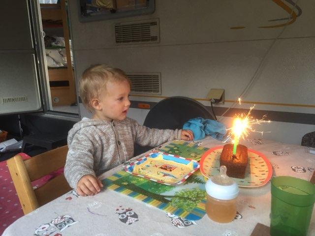
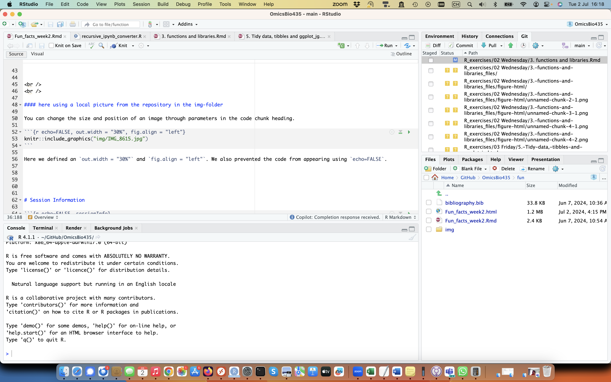

# Overview

In this document, we will go through some fun facts to familiarize with multiple things. For example we would like to share pictures from everyone and also comment it with an appropriate caption. This is easy possible here in Rmarkdown. Over time we will also show how to include a table of contents and how to include a bibliography.
Learning Rmarkdown is fun and easy but also very useful as for example documentation of R-packages is often written in Rmarkdown.
To show how you can use references in Rmarkdown we will also include a reference section at the end of this document.
We recently published an R package _[prolfqua]_ [@prolfquawolski2023] that we use to filter and normalize the proteomics data, generate visualizations, and to compute differential expression analysis.
Rmarkdown is especially useful to have R-code and text in the same document and to generate reports that can be easily shared with others. It can even generate interactive html documents.


## Jonas Grossmann

#### here using a webresource
{width="20%"}


<br /> 
<br /> 

#### here using a local picture from the repository in the img-folder

You can change the size and position of an image through parameters in the code chunk heading.

```{r echo=FALSE, out.width = "30%", fig.align = "left"}

```

Here we defined an `out.width = "30%"` and `fig.align = "left"`. We also prevented the code from appearing using `echo=FALSE`.


```{r echo=FALSE, out.width = "60%", fig.align = "left"}

```


# Session Information

```{r echo=FALSE, sessionInfo}
pander::pander(sessionInfo())
```

# References {-}

<div id="refs"></div>
